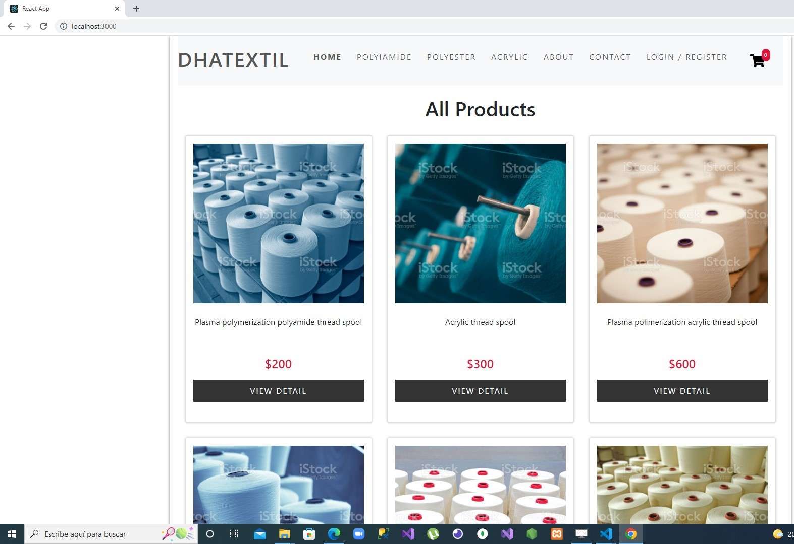
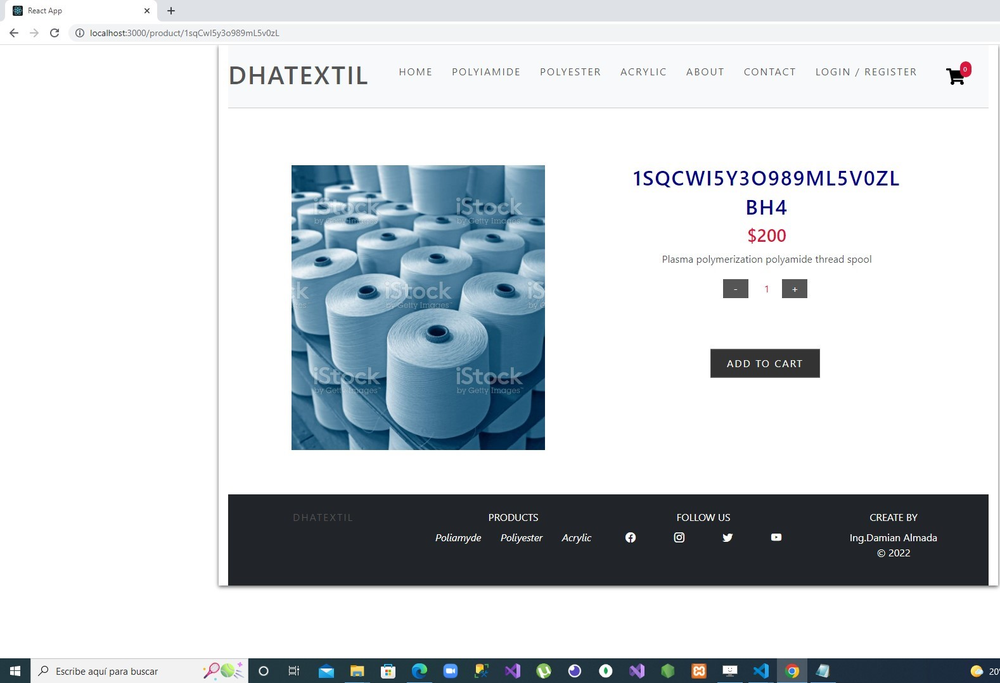

 # DHATextil

E-commerce desarrollado en React, este proyecto esta basado en mi tesis de trabajo final de ingenieria que consiste en una empresa dedicada a la fabricacion
de bobinas de hilado textil industrial de Poliamida,Poliester y Acrilico.
La fabricacion se lleva a cabo a traves de 2 metodologias, la polimerizacion convencional y la polimerizacion por plasma. 

## Entrega Final

>
---

---------
## Imágenes de la web
----------

*Index*
>
----------

*Detalle de Producto*
>
----------
---

**Dependencias del proyecto:**

> - **json-server:** 
> - **react-router-dom:**

**<i Navegabilidad / Componentes**
> - [X] Responsive / estilos aplicados de forma estética.
> - [X] Manejo de imágenes.
> - [X] Routes y Links para navegaciones.
> - [X] Navbar con carrito implementado.
> - [X] Promises y Hooks.
----------